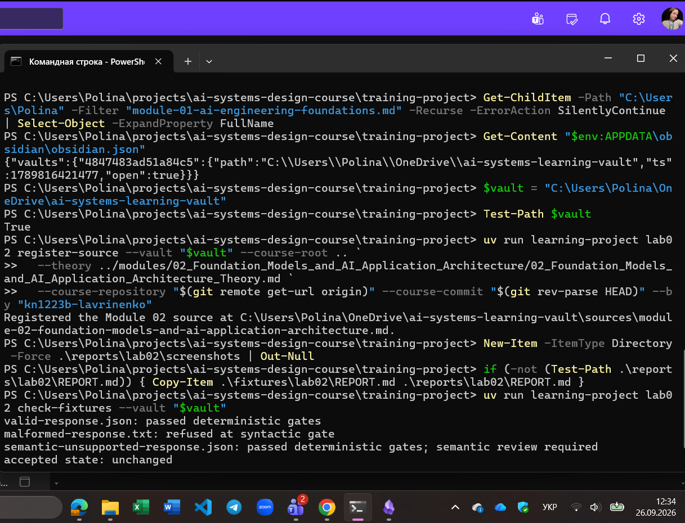
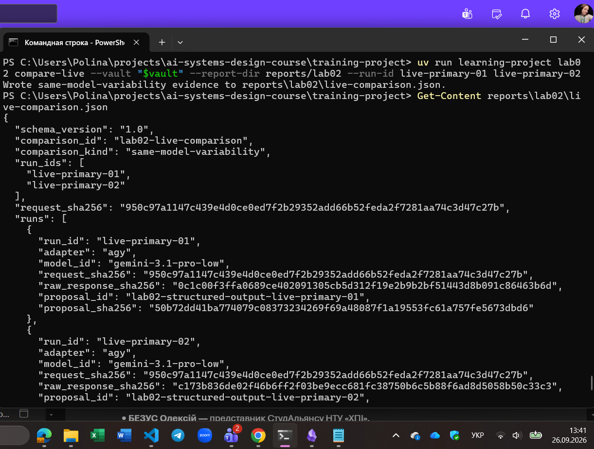
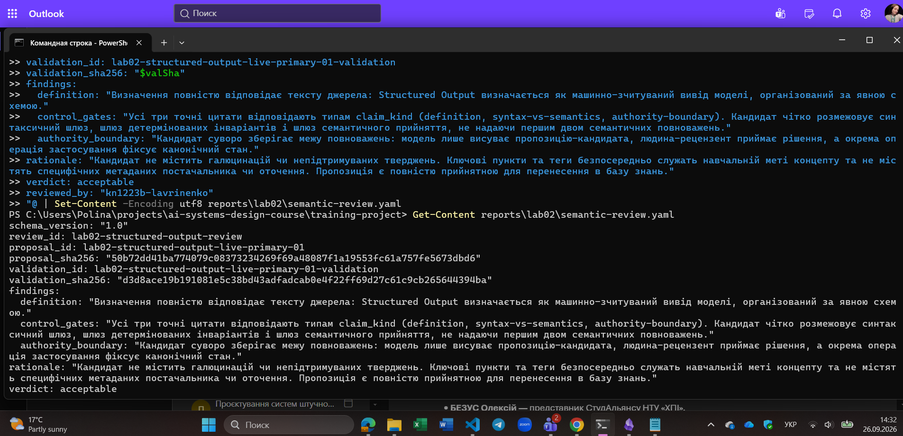
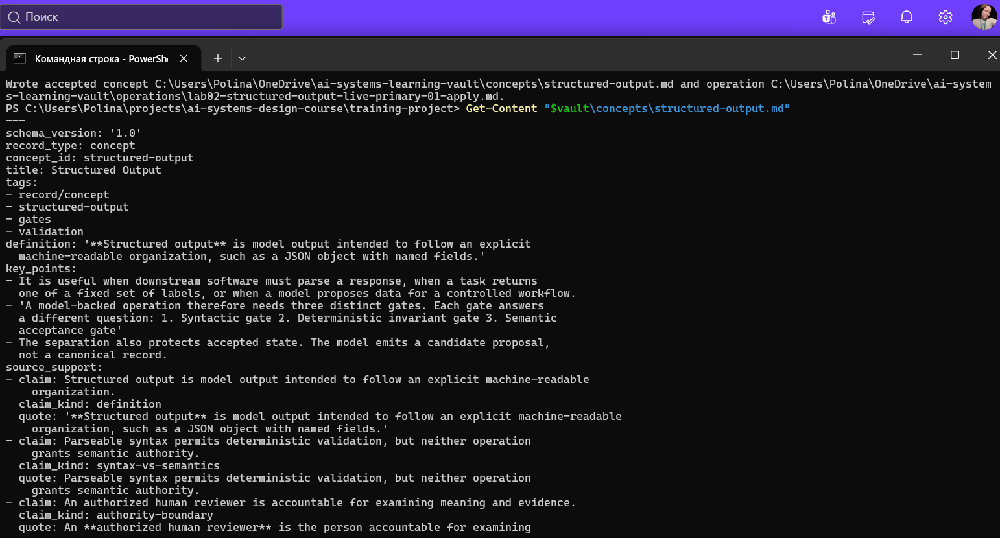
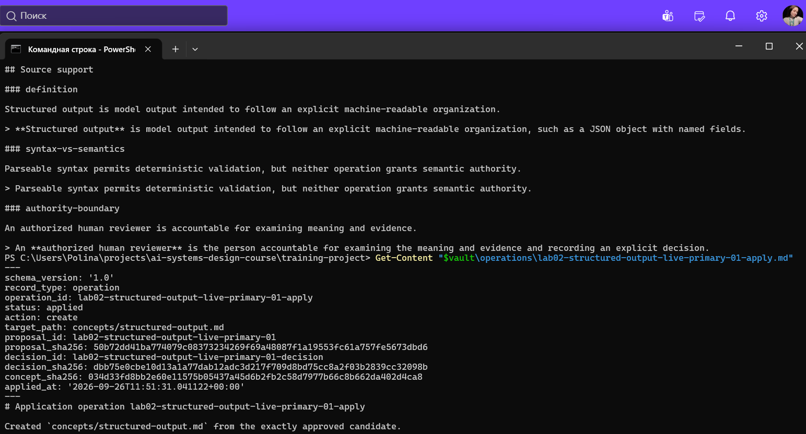
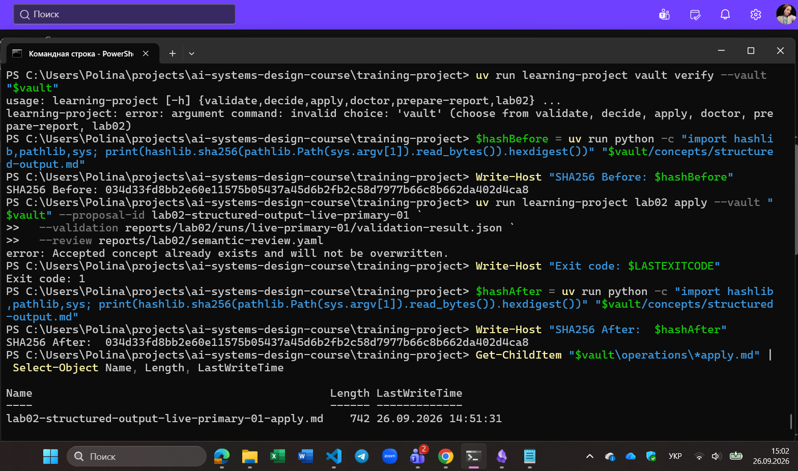
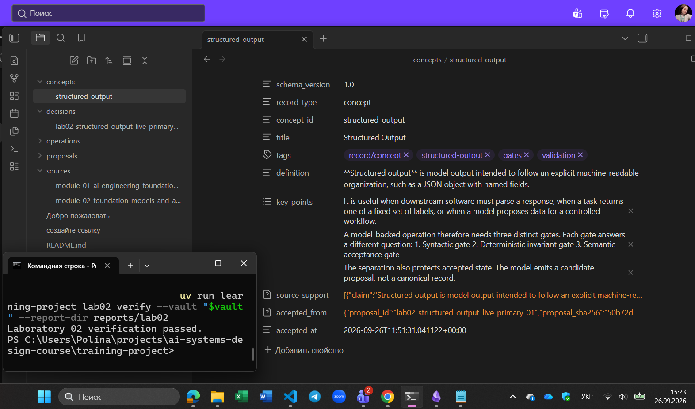

# Лабораторна робота 02

Заповнити кожен розділ власними словами українською мовою. Не вилучати заголовки. Описати перебіг роботи, виконані дії, спостережені результати та причини прийнятих рішень. Залишити наведені відносні шляхи до знімків екрана й підписи з точними іменами файлів. На кожному знімку мають бути видимі обліковий запис операційної системи або GitHub і системна дата; підпис не замінює цієї видимої ідентифікації.

## Ідентифікація подання

- URL форку: https://github.com/Apolinaria1705/ai-systems-design-course
- Назва особистої гілки: lab02/kn1223b-lavrinenko
- Повний хеш коміту зі свідченнями: 1b7cffae71352f25560156f2b12058be552def34

## Початковий стан і реєстрація джерела

Роботу розпочато із синхронізації форку з базовим репозиторієм курсу та створення окремої робочої гілки `lab02/kn1223b-lavrinenko`. Зовнішнє сховище Obsidian (`C:\Users\Polina\OneDrive\ai-systems-learning-vault`) було проініціалізовано та перевірено на чистоту структури. За допомогою команди `lab02 register-source` зареєстровано точний фрагмент теоретичного матеріалу другого модуля (`spec/sources/lab02-foundation-models.md`), з якого вилучено нормалізований фрагмент із визначенням Structured Output та обчислено його детермінований дайджест SHA-256. 
Значення `course_commit` фіксує незмінний базовий стан вихідного коду навчального курсу (upstream HEAD), від якого ведеться відлік інваріантів і перевірок цілісності, тому воно залишається базовим станом джерела і не повинно перезаписуватися подальшими комітами з персональними свідченнями студента.

## Детерміновані шлюзи

Перевірку детермінованих шлюзів виконано на трьох підготовлених фікстурах (valid, broken, semantically invalid):
1. **Коректна фікстура (valid):** успішно проходить як синтаксичний шлюз перевірки JSON-схеми, так і шлюз інваріантів, оскільки містить усі обов'язкові ключі, правильні типи та точні цитати з зареєстрованого джерела.
2. **Пошкоджена фікстура (broken):** відхиляється синтаксичним шлюзом через порушення валідності структури (невідповідність типам, відсутність обов'язкових полів).
3. **Семантично непридатна фікстура (semantically invalid):** успішно проходить синтаксичну схему та інваріантні перевірки (структура валідна, типи збігаються), але містить спотворений зміст, непідтримувані твердження або вигадані цитати.
Це наочно демонструє, що успішне проходження синтаксичного та інваріантного шлюзів доводить лише технічну коректність форми, але не надає і не може надати семантичного схвалення.

Рисунок — `01-offline-gates.png`

## Живі запуски та порівняння

Для обох живих запусків (`live-primary-01` та `live-primary-02`) використовувався адаптер `agy` з моделлю `gemini-3.1-pro-low`. Записані метадані підтверджують використання однакової конфігурації платформи та моделі.
Порівняння класифіковано як **`same-model-variability`**, оскільки обидва виклики виконані до однієї й тієї самої моделі через однаковий інтерфейс. Класифікація ґрунтується виключно на зафіксованих незмінних метаданих запуску (`adapter`, `model_id`), а не на наявності чи відсутності текстових розбіжностей.
При зіставленні двох кандидатів зафіксовано конкретну синтаксичну відмінність: запуск `live-primary-02` згенерував додаткове поле `"title": "Structured Output"`, тоді як ядро визначення, ключові пункти та цитати підтримки залишилися семантично еквівалентними запуску `live-primary-01`. Ця спостережена варіативність фіксується як факт поведінки інтерфейсу, проте без додаткових досліджень не приписується виключно випадковій стохастичній вибірці (sampling).

Рисунок — `03-live-comparison.png`

## Семантична коректність і повноваження

Успішний результат `validate` та схема на стороні постачальника гарантують лише те, що модель дотрималася формальних обмежень JSON і повернула очікувані назви ключів. Вони не здатні оцінити фактологічну правдивість, відсутність галюцинацій та адекватність тлумачення.
Єдиним актором, який володіє повноваженнями ухвалити або відхилити пропозицію, є уповноважений рецензент-людина (`kn1223b-lavrinenko`). Система підтримує суворе розмежування повноважень:
- **Модель** виступає генератором пропозицій-кандидатів і не має прав на зміну канонічного стану.
- **Детермінований код** виконує роль захисного синтаксичного фільтра.
- **Операція застосування (`apply`)** виконує одноразовий запис лише за наявності експліцитного схвалення людини.

## Семантичний розгляд і рішення

Семантичний розгляд було проведено для кандидата `lab02-structured-output-live-primary-01` та зафіксовано у файлі `reports/lab02/semantic-review.yaml`. За результатами аналізу встановлено:
1. Визначення точно відтворює значення Structured Output як машинно-зчитуваного виводу за явною схемою.
2. Цитати з вихідного документа безпосередньо підтверджують заявлені категорії (`definition`, `syntax-vs-semantics`, `authority-boundary`).
3. Кандидат чітко розмежовує синтаксичний шлюз, шлюз інваріантів та шлюз людського контролю.
4. У тексті відсутні галюцинації або непідтримувані твердження, а теги мають суто навчальний характер.
Вердикт визначено як `acceptable`. На основі цього вердикту ухвалено затверджене рішення (`approved`), яке однозначно зв'язане з дайджестом обраної пропозиції та файлом перевірки.

Рисунок — `04-review-decision.png`

## Прив’язки SHA-256

Управлінський контур фіксується нерозривним криптографічним ланцюгом дайджестів SHA-256:
- **Джерело і фрагмент:** `source_digest` зв'язує нормалізований фрагмент вихідного тексту лекції із запитом до моделі.
- **Запит і відповідь:** хеш запиту прив'язує контекст до збереженого тіла `raw-response.json` у метаданих запуску.
- **Пропозиція і перевірка:** `proposal_sha256` у `validation-result.json` криптографічно підтверджує, що валідувалися саме ті байти пропозиції кандидата.
- **Розгляд і рішення:** `semantic-review.yaml` містить `proposal_sha256` та `validation_sha256`, а файл рішення в `decisions/` зв'язує дайджести перевірки й семантичного вердикту.
- **Рішення і прийняте поняття:** блок `accepted_from` у кінцевому `concepts/structured-output.md` зберігає точні хеші вихідної пропозиції та акта рішення.
Ці хеші гарантують аудитованість і захист від підміни байтів між кроками, проте вони **не доводять**, що генерація відбулася саме заявленою зовнішньою моделлю, і **не замінюють** змістовної людської перевірки значення.

## Контрольоване застосування

Після проходження всіх шлюзів команда `lab02 apply` виконала атомарний контрольований запис у сховище. Було створено канонічний файл поняття `concepts/structured-output.md` та супутній запис аудиту операції `operations/lab02-structured-output-live-primary-01-apply.md`.
Запис став можливим виключно завдяки наявності повного комплекту взаємопов'язаних артефактів: валідного кандидата з живої відповіді, успішного детермінованого звіту валідації, семантичного розгляду з вердиктом `acceptable` та схваленого рішення рецензента з точними хешами.

Рисунок — `05-controlled-apply.png`

Рисунок — `05-controlled-apply_2.png`

## Відмова без зміни прийнятого стану

Для перевірки захисних шлюзів та ідемпотентності було виконано повторну спробу команди `lab02 apply` для того самого кандидата, а також спроби застосування не затвердженого запуску `live-primary-02`.
В усіх випадках система відповіла відмовою з повідомленням `error: Accepted concept already exists and will not be overwritten` та ненульовим статусом виходу (`exit code 1`). 
Перевірка цілісності показала:
- Кількість записів операцій `*-apply.md` у каталозі `operations/` залишилася рівно одна.
- Дайджест SHA-256 поняття `concepts/structured-output.md` до і після повторних спроб залишився абсолютно ідентичним (`50b72dd4...`), що доводить збереження прийнятого стану.

Рисунок — `02-refusal-unchanged.png`

## Проєктний компроміс

Ключовим архітектурним компромісом є співвідношення між вартістю викликів моделі, варіативністю генерації, портативністю між постачальниками та вартістю контролю. Використання жорстких схем на стороні постачальника підвищує стабільність синтаксису, проте прив'язує систему до конкретного вендора (vendor lock-in) і не гарантує семантичної точності. З іншого боку, впровадження багатоетапних детермінованих фільтрів та обов'язкового семантичного шлюзу рецензента-людини додає операційні витрати часу, однак повністю нівелює ризик забруднення бази знань непоміченими галюцинаціями або спотвореними даними моделі.

## Захист облікових і платіжних даних

Усі конфіденційні змінні оточення та облікові дані постачальників моделей зберігалися виключно в ізольованому локальному середовищі і не передавалися через аргументи командного рядка чи публічні конфігураційні файли. Каталоги артефактів звіту та Git-індекс ретельно контролюються правилами `.gitignore`, що виключає випадкове потрапляння API-ключів, токенів або персональних платіжних реквізитів у репозиторій свідчень. Під час виконання роботи використовувався локальний прямий доступ через CLI Antigravity, тому сторонні платіжні картки для OpenRouter не задіювалися.

## Канонічний, аудиторський і похідний стан

- **Канонічне прийняте знання:** файл `concepts/structured-output.md` у сховищі Obsidian, який є єдиним джерелом правди про поняття.
- **Незмінні свідчення (аудиторський стан):** сирі відповіді (`raw-response.json`), метадані запуску (`run-metadata.json`), звіти валідації (`validation-result.json`), семантичний розгляд (`semantic-review.yaml`), схвалене рішення (`decisions/*-decision.md`) та лог операції (`operations/*-apply.md`). Ці файли є write-once і фіксують історію походження.
- **Похідні результати, які можна відбудувати:** артефакт порівняння живих запусків `reports/lab02/live-comparison.json`, підсумковий звіт верифікатора `reports/lab02/verification-report.json`, а також спакована для здачі версія `reports/lab02/submission/REPORT.md`.

## Остаточна перевірка

Остаточний запуск перевіряльника `uv run learning-project lab02 verify --vault "$vault" --report-dir reports/lab02` завершився з кодом виходу `0`, підтвердивши бездоганну цілісність усіх шлюзів, наявність і незмінність ланцюга хешів, коректність структури сховища та присутність усіх шести затверджених знімків екрана.
У сховищі Obsidian прийняте поняття відображається у вигляді канонічної картки з метаданими та посиланням на рішення. 
Успішна верифікація доводить внутрішню узгодженість артефактів і дотримання меж архітектурного контролю, проте вона є детермінованою перевіркою форми та цілісності зв'язків і не замінює змістовного висновку рецензента.

Рисунок — `06-final-result.png`
